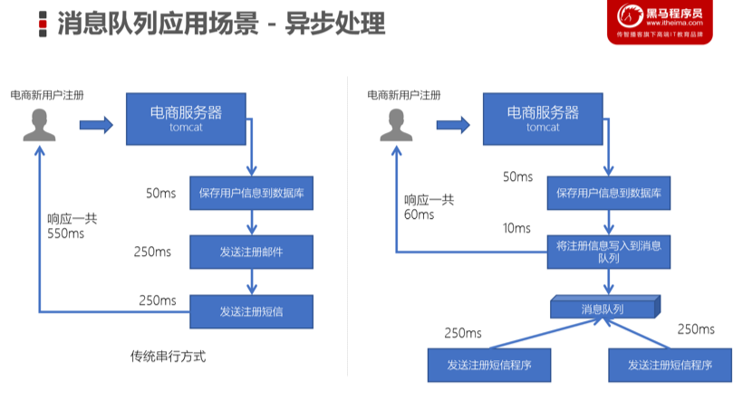
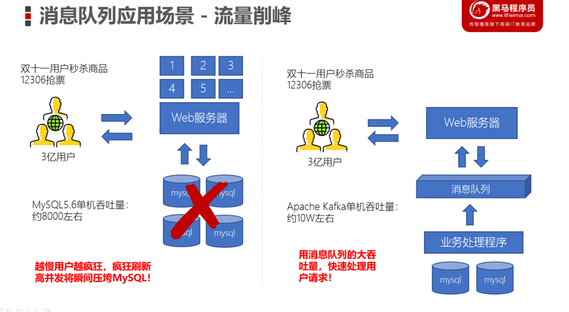
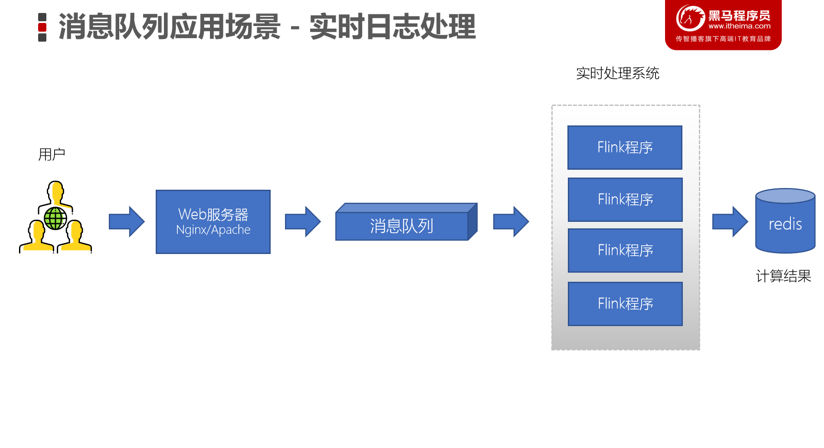

## Kafka的应用场景

* 异步处理
	* 可以将一些**比较耗时的操作**放在其他系统中，通过消息队列将需要进行处理的消息进行存储，其他系统可以消费消息队列中的数据
	* 比较常见的：发送短信验证码、发送邮件

* 系统解耦
	* 原先一个微服务是通过接口（HTTP）调用另一个微服务，这时候耦合很严重，只要接口发生变化就会导致系统不可用
	* 使用消息队列可以将系统进行解耦合，现在第一个微服务可以将消息放入到消息队列中，另一个微服务可以从消息队列中把消息取出来进行处理。进行系统解耦

* 流量削峰
	* 因为消息队列是低延迟、高可靠、高吞吐的，可以应对大量并发

* 日志处理
	* 可以使用消息队列作为临时存储，或者一种通信管道

